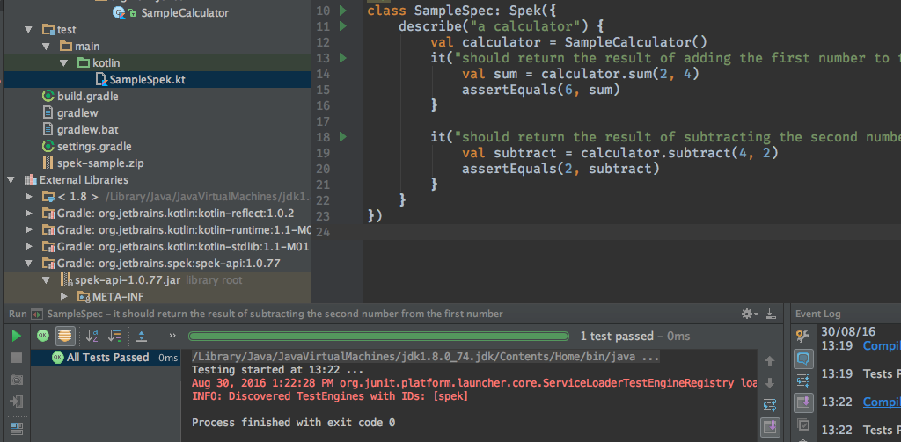

# Spek goes 1.0

We've finally reached the 1.0 mark! 

There have been quite a few changes leading to 1.0 in terms of the API, but we're hoping that it will now remain stable moving forward. 
Below is a summary of features and changes that this first version brings with it.

## JUnit Support

Spek has always relied on JUnit under the covers for test discovery and execution. The choice was made so as to provide a certain level of functionality without having to reinvent the wheel from day one. This includes but not limited to
integration with IDE's and build servers, ability to run tests from the command line, etc.

When preparing for Spek 1.0, we decided to make two fundamental changes:

* Abstract JUnit. We've abstracted JUnit so that when we (eventually) implement our own infrastructure we can do so easily without impacting the API or any behaviour.

* Move to JUnit 5. We've moved to JUnit 5. It offers significant advantages over 4. If you cannot use JUnit 5, there's still the option to run with [JUnit 4 runner](http://junit.org/junit5/docs/current/user-guide/#running-tests-junit-platform-runner). 
 
## New API's
 
### describe, describe, describe

Spek was initially designed with the *given*, *on*, *it* syntax. And this API still remains. However, at some point we also added support for more Jasmine style
 *describe* syntax. Essentially, this means that you have the option to use [either](http://jetbrains.github.io/spek/docs/latest/#_basic_structure).

### Context and Subjects, beforeEach and afterEach

We've introduced the concepts of [contexts and subjects](http://jetbrains.github.io/spek/docs/latest/#_fixtures), along with finally fixing the *beforeEach* and *afterEach* directives. 

### fdescribe dropped

At some point, an (f) for focused API was introduced to allow running of individual tests. While this was useful, it was also a little bit problematic as it required
modifying the code every time you want to run a specific test. This API has now been dropped. We've addressed the issue of running individual tests via the [IntelliJ IDEA plugin](#intellij-idea-plugin).

### xdescribe introduced

You can ignore tests using the *x* prefix. 
*Note: this might actually be changed for annotations in the future.*
 
### Annotations are gone

Unless you're using JUnit 4 runner, you no longer need to use JUnit annotations for indicating tests. If you're using JUnit 4 runner, you'll need
to add the following annotation to your tests

```
@RunWith(JUnitPlatform::class)
```


## IntelliJ IDEA Plugin

We finally have an [IntelliJ IDEA plugin](https://plugins.jetbrains.com/plugin/8564) for running Spek, thanks to Ranie. It should work with IntelliJ IDEA as well as Android Studio. 




*Please note that the IntelliJ IDEA plugin requires JUnit 5*

## In summary

It's been a very long road to get to here, and at times too dormant. But we made it, and it would not have been possible without the contributions of everyone including Laura Kogler, Ilya Ryzhenkov, Eugene Petrenko. But a special mention to Ranie Jade de Ramiso. He put in a lot of hours and work to bring Spek to a 1.0.

This is just the start of Spek. We still have many things planned, so please give us your [feedback](https://github.com/jetbrains/spek/issues).

Thank you!


